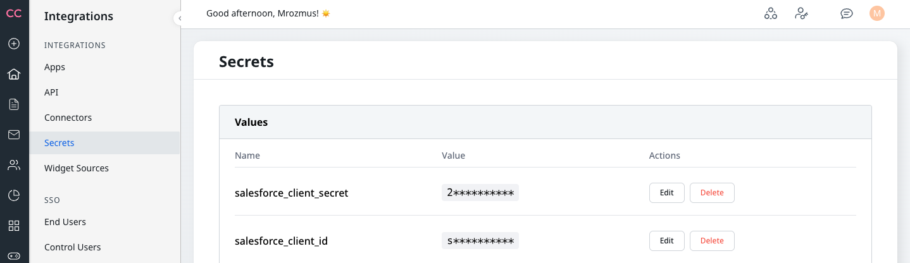
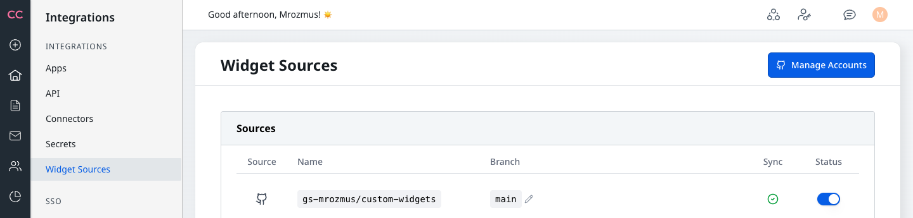

# Salesforce Cases Form Widget

This widget integrates with your Salesforce instance to enable case management directly from your community. Follow the setup steps below to get started.

---

## Prerequisites

- Access to your Salesforce instance with administrator privileges
- Access to your community administration panel

---

## Setup Instructions

### Step 1: Create External Client App in Salesforce

Navigate to your Salesforce instance:  
**Settings → Platform Tools → Apps → External Client Apps → External Client App Manager**

### Step 2: Create New External Client App

Click to create a new External Client App.

### Step 3: Enable Client Credentials Flow

Enable the Client Credentials Flow for your app.

### Step 4: Retrieve Consumer Key and Secret

Copy your Consumer Key and Consumer Secret — you'll need these for the connector configuration.

### Step 5: Create Secrets

In your community admin panel, go to **Connectors > Secrets** and create two secrets:

- `salesforce_client_id` — your Consumer Key from Step 4
- `salesforce_client_secret` — your Consumer Secret from Step 4

### Step 6: Fork Repository and Configure Salesforce URL

1. Fork this repository to your own GitHub account
2. Edit `connectors_registry.json` in the repository root
3. Replace every occurrence of `YOUR_INSTANCE.my.salesforce.com` with your actual Salesforce instance domain (e.g., `mycompany.my.salesforce.com`)
4. Commit and push the changes

### Step 7: Connect Repository

In your community admin panel, go to **Widget Sources** and connect your forked GitHub repository.

### Step 8: Add Widget to Your Community

Add the new Salesforce Cases widget to your community.

---

## Widget Preview

### Signed-in Users

For authenticated users, the widget displays their existing cases and allows creating new ones:

### Anonymous Users

For visitors who are not signed in, the widget shows a disabled form:

